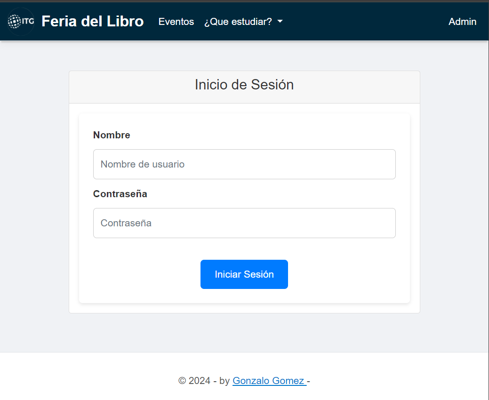
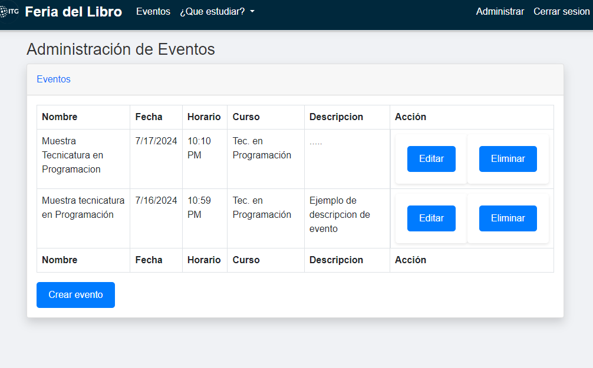
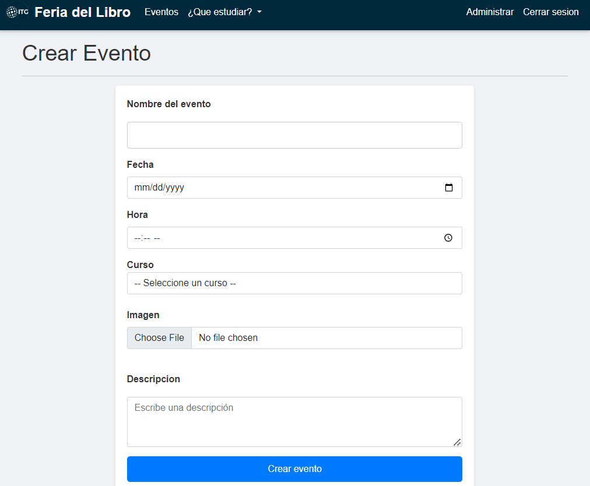
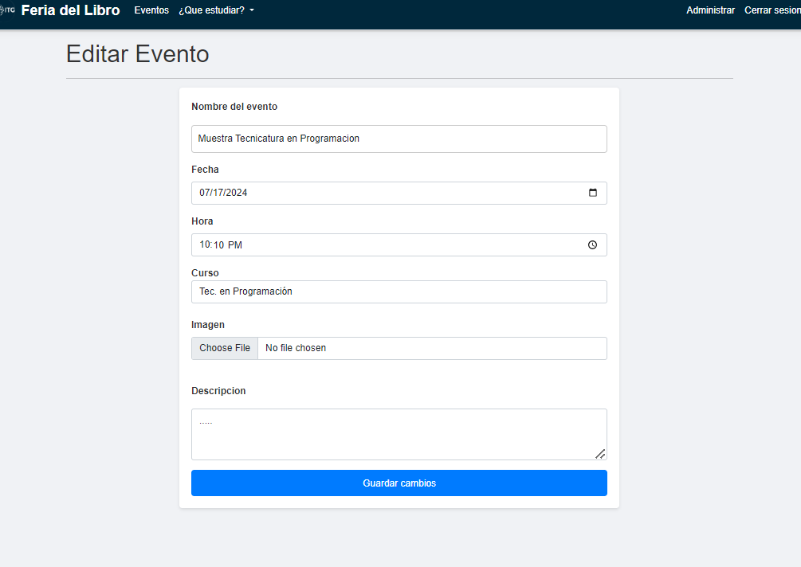
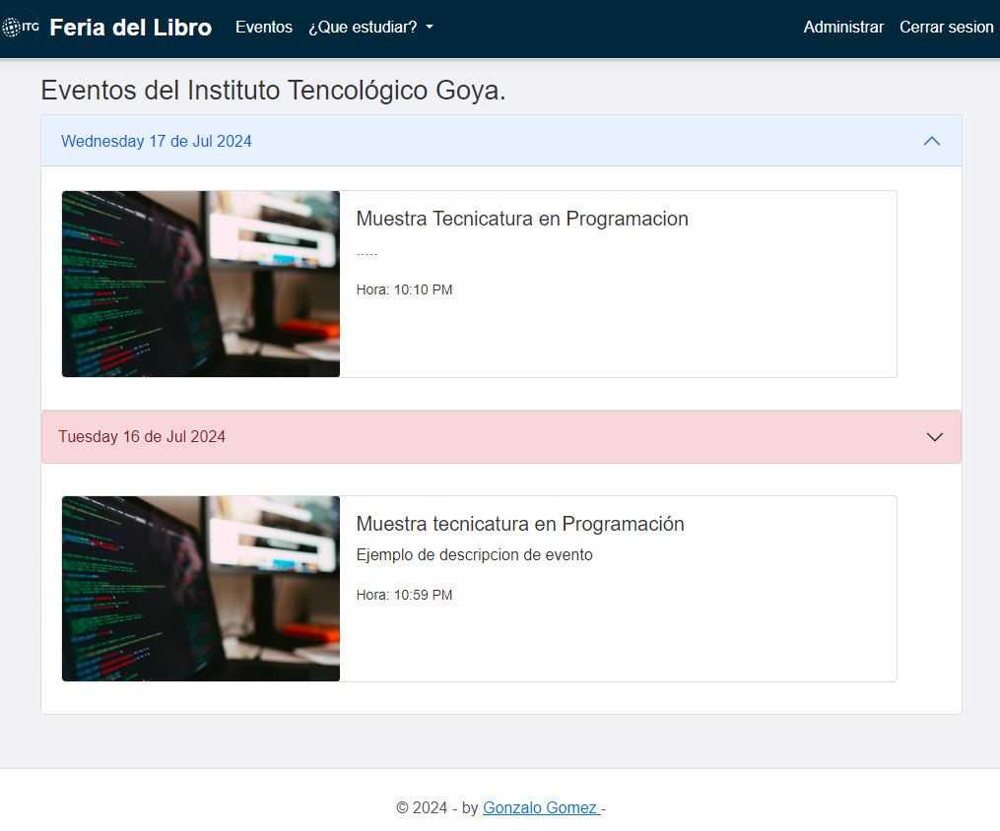
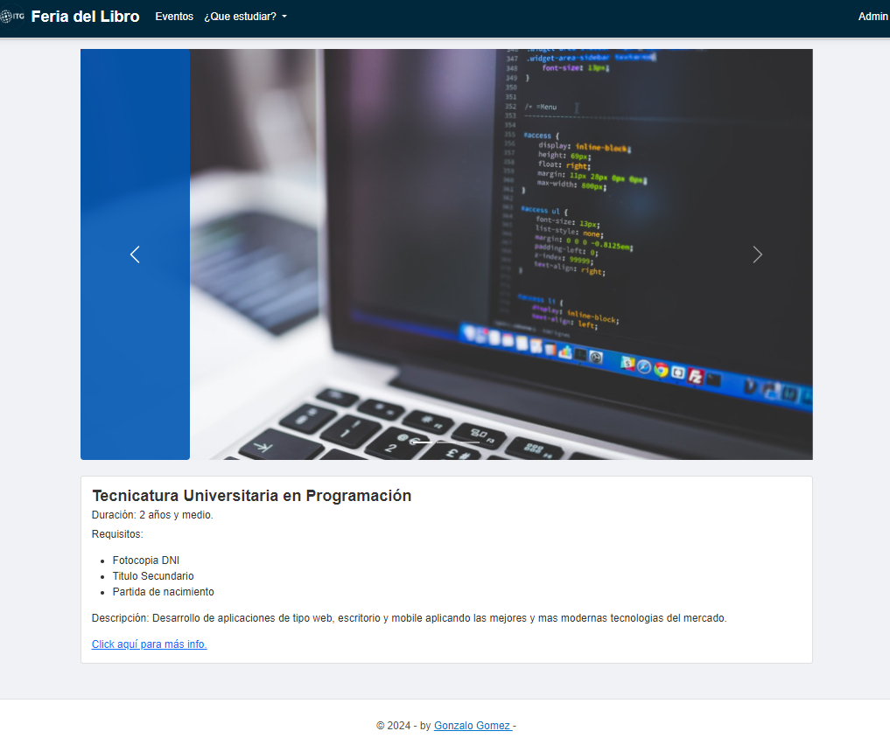

# "Feria del Libro" Project
This project was implemented in a real-life scenario as part of a sample for the public. On this website, the public can enter to see the events of the current day (and the day before, which are displayed in red) and can also search for courses offered by the institution. It also has a management panel for admin users (with authentication) to create, edit, and delete events.
## Used technology
* Framework:  .NET Core 8, ASP.NET Core MVC.
* ORM: Entity Framework.
* Data Base : SQL Server.
* Front-End Technologies: Razor Pages + Bootstrap.
### Architectures and design patterns implemented: 
* Repository pattern.
* Dependency Inyection.
* Model View Controller.
* N-Layer pattern.

### Functionalities:
## Login

## Admin panel

### create

### edit

## Home - Events

## Courses details

### (Deployed in Azure Cloud Service)